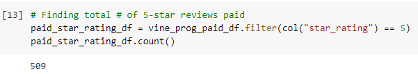
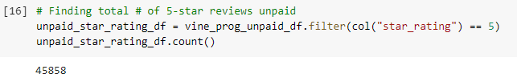
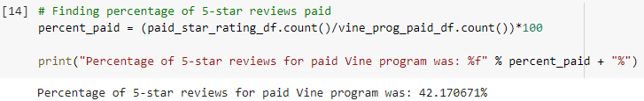
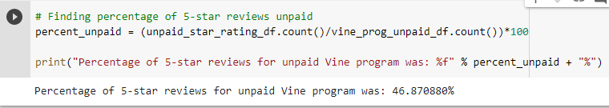

# Amazon_Vine_Analysis

## Overview of the analysis of the Vine program
In this project, I had access to approximately 50 datasets. Each one contained reviews of a specific products, from clothing apparel to wireless products. I had to pick one of these datasets and use PySpark to perform the ETL process to extract the dataset, transform the data, connect to an AWS RDS instance, and load the transformed data into pgAdmin. Next, I used PySpark to determine if there is any bias toward favorable reviews from Vine members in your dataset. A summary of the analysis is shown below.

* How many Vine reviews and non-Vine reviews were there?
    * Paid Vine Reviews: 1,207 reviews.

    

    * Non-Vine Reviews: 97,839 reviews.
    
    

* How many Vine reviews were 5 stars? How many non-Vine reviews were 5 stars?
    * Paid Vine 5 star Reviews: 509 reviews.
    
    
    
    * Non-Vine 5 star Reviews: 45,858 reviews.
    
    
    
* What percentage of Vine reviews were 5 stars? What percentage of non-Vine reviews were 5 stars?
    * Percentage of Vine 5 star Reviews: ~ 42.17%
    
    
    
    * Percentage of non-Vine 5 star Reviews: ~ 46.87%
    
    

## Summary
This data was quite interesting. Before I began my investigation, I believed that the paid Vine Analysis data would have a higher percentage of 5 star reviews. However, the results state otherwise. In fact, it says the unpaid data has a higher percentage of 5 star reviews (46.87% 5 star satisfaction for unpaid vs. only 42.17% 5 star satisfaction for paid services with Vine). If we wanted to go a step further in this analysis, we could filter out for only verified purchases for the programs. This would decrease the amount of starting data by about 800,000 less to test against (original starting data had nearly 4,900,000 data points).
